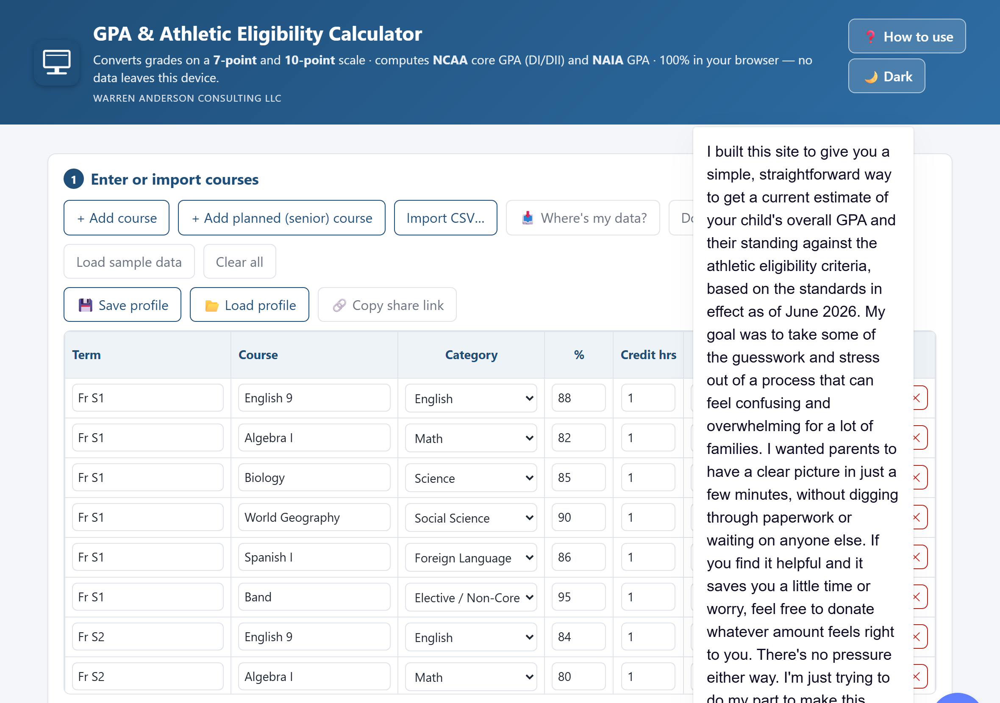
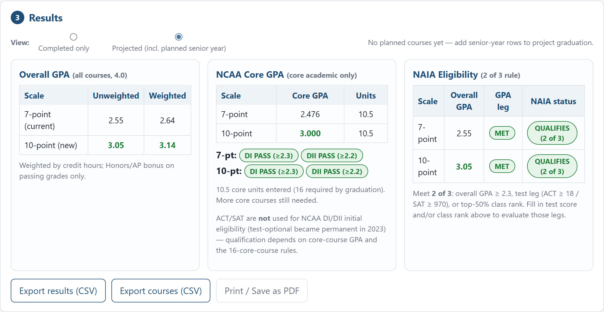
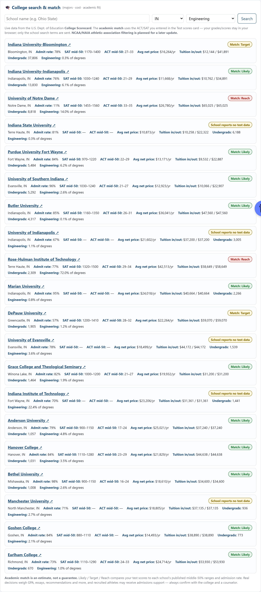
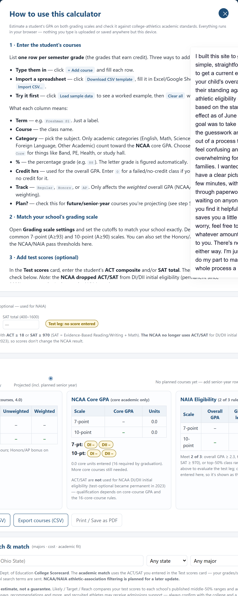

# GPA & Athletic Eligibility Calculator

A single-file web app that converts high-school grades between a **7-point** and **10-point**
grading scale and computes:

- **Overall GPA** — 7-pt vs 10-pt, unweighted and weighted (Honors/AP bonus)
- **NCAA core-course GPA** — core academics only, unweighted, with live **Division I (≥2.3)** and **Division II (≥2.2)** PASS/FAIL checks
- **NAIA eligibility** — evaluates the **"2 of 3"** rule using overall GPA, **ACT/SAT test scores**, and (informationally) class rank
- **ACT / SAT input** — feeds NAIA's test leg (ACT ≥ 18 / SAT ≥ 970). *The NCAA dropped test scores from DI/DII initial eligibility in 2023, so they don't affect the NCAA result — the app notes this.*
- **College search & match** — live search of U.S. colleges (federal **College Scorecard**) by name / state / major, showing **cost, admission rate, SAT/ACT ranges**, plus an **academic match** (Likely / Target / Reach) based on the ACT/SAT entered
- **Senior-year projection** — flag planned courses and toggle between *Completed only* and *Projected at graduation*

Everything runs **client-side** — no server, no data leaves the browser. Suitable for student
records (FERPA-friendly).

**▶ Live app:** https://wacit.github.io/gpa-eligibility-calculator/

> In the app, click **❓ How to use** (top-right of the header) for the same guide below. It
> also opens automatically on your first visit.

## Screenshots

| Enter courses | Results & eligibility |
|:---:|:---:|
|  |  |

**College search & match** — live cost, admission rate, SAT/ACT ranges, and a Likely/Target/Reach estimate:



Built-in **How to use** guide (opens automatically on first visit):



*(Screenshots use fictional sample data.)*

## How to use

### 1. Enter the student's courses
List **one row per semester grade** (the grades that earn credit). Three ways to add them:

- **Type them in** — click **+ Add course** and fill each row.
- **Import a spreadsheet** — click **Download CSV template**, fill it in Excel/Google Sheets, then **Import CSV…**.
- **Try it first** — click **Load sample data** to see a worked example, then **Clear all** when ready.

What each column means:

| Column | What to enter |
|--------|---------------|
| **Term** | A label, e.g. `Freshman S1`. |
| **Course** | The class name. |
| **Category** | The subject. Only academic categories (English, Math, Science, Social Science, Foreign Language, Other Academic) count toward the **NCAA** core GPA. Use `Elective / Non-Core` for Band, PE, Health, study hall, etc. |
| **%** | The percentage grade (e.g. `88`). The letter grade is computed automatically. |
| **Credit hrs** | Used for the overall GPA. Enter `0` for a failed/no-credit class if your school awards no credit. |
| **Track** | `Regular`, `Honors`, or `AP` — affects the *weighted* overall GPA only (NCAA/NAIA ignore weighting). |
| **Plan?** | Check for **future/senior-year** courses you're projecting (see step 4). |

### 2. Match your school's grading scale
Open **Grading scale settings** and set the cutoffs to match your school exactly. Defaults are the
common 7-point (A ≥ 93) and 10-point (A ≥ 90) scales. You can also set the Honors/AP bonus and the
DI / DII / NAIA pass thresholds here.

### 3. Add test scores (optional)
In the **Test scores** card, enter the **ACT composite** and/or **SAT total**. These feed the **NAIA** check.
**Note:** the NCAA no longer uses ACT/SAT for DI/DII initial eligibility (permanent since 2023), so scores don't change the NCAA result — the app states this inline.

### 4. Read the results
- **Overall GPA** — your full GPA on both scales, unweighted and weighted (green = the 10-point result).
- **NCAA Core GPA** — core-academic courses only, no weighting; badges show pass/fail vs **DI ≥ 2.3** and **DII ≥ 2.2**, and it tracks progress toward the 16 required core units.
- **NAIA Eligibility** — the **"2 of 3"** rule: overall GPA ≥ 2.3, test leg (**ACT ≥ 18 / SAT ≥ 970**), or top-50% class rank. Two legs met → **QUALIFIES**; one leg met → still needs the top-50% rank leg.

### 5. Project the senior year (optional)
Add upcoming courses with the **Plan?** box checked (or use **+ Add planned (senior) course**). Then
use the **View** toggle above the results to switch between **Completed only** and
**Projected (incl. planned)** to see where the GPA is headed at graduation.

### 6. Explore colleges (optional)
In **College search & match**, search by school name, state, and/or major. Each result shows **cost** (net price & tuition), **admission rate**, and **SAT/ACT middle-50%** ranges, with a link to the school. If you entered ACT/SAT, you also get an **academic match** badge — **Likely / Target / Reach** — comparing your scores to the school's ranges and selectivity.
- *Estimate only*, not a guarantee; recruited athletes may receive extra admissions support.
- Data: U.S. Dept. of Education **College Scorecard**. Only your search terms are sent — your grades/scores stay in the browser.
- Uses a free `api.data.gov` key. The app ships with the shared `DEMO_KEY` (heavily rate-limited); for real use, get a free key at <https://api.data.gov/signup/> and replace `SCORECARD_KEY` in `index.html`.
- *Coming later:* an NCAA/NAIA athletic-association + division filter.

### 7. Save or share
- **Export results (CSV)** — the GPA/eligibility summary (includes ACT/SAT and NAIA status).
- **Export courses (CSV)** — your course list, to reopen later.
- **Print / Save as PDF** — a clean printout for a counselor or coach.

> **Privacy:** your data is remembered only in *this browser on this device*. **Planning only:**
> confirm your school's exact scale/weighting and its official NCAA-approved core-course list at the
> NCAA Eligibility Center — official eligibility is determined by the NCAA/NAIA.

## Files

| File | Purpose |
|------|---------|
| `index.html` | The entire app (HTML + CSS + JS, no dependencies). Open it directly or host it. |
| `gpa_template.csv` | Starter import file showing the expected columns. |

## Input format (CSV)

Use a UTF-8 CSV with this header row:

```
Term,Course,Category,Percent,CreditHours,Track,Planned
```

| Column | Notes |
|--------|-------|
| **Term** | Free text, e.g. `Freshman S1`. One row per **semester** grade. |
| **Course** | Free text. |
| **Category** | `English`, `Math`, `Science`, `Social Science`, `Foreign Language`, `Other Academic`, or `Elective / Non-Core`. Only the academic categories count toward the NCAA core GPA. |
| **Percent** | Numeric grade percentage (e.g. `88`). |
| **CreditHours** | Used for the overall GPA. Enter `0` for a failed/no-credit course if your school awards no credit. |
| **Track** | `Regular`, `Honors`, or `AP` (drives the weighted-GPA bonus only). |
| **Planned** | `Yes` for future/senior-year courses, `No` (or blank) for completed. |

The importer is case-insensitive and tolerant of abbreviations. You can also enter courses
manually and **Download CSV template** / **Export courses** from inside the app.

## Adjustable settings (in the app)

- 7-point and 10-point cutoffs (min % for A/B/C/D) — set these to match your school exactly
- Honors / AP weighting bonus
- NCAA unit per semester course (default 0.5) and the DI / DII / NAIA thresholds

## Run locally

Just open `index.html` in any modern browser. (For development with live reload you can serve
the folder with `py -m http.server` and visit `http://localhost:8000/`.)

## Deploy

### GitHub Pages
1. Create a repo and add these files at the root (or in a `/docs` folder).
2. **Settings → Pages → Build and deployment → Source: Deploy from a branch**, pick `main` and `/ (root)` (or `/docs`).
3. Your app is live at `https://<user>.github.io/<repo>/`. `index.html` is served automatically.

### Cloudflare Pages / Netlify
Drag-and-drop the folder into the dashboard, or connect the repo. No build command needed —
it's a static site. Output/publish directory = the folder containing `index.html`.

### SharePoint / Microsoft 365 (internal)
- Upload `index.html` to a document library and use **... → Open** or host via an internal site.
- Note: some tenants render uploaded HTML as download-only for security. For an embeddable
  experience, host on Pages/Netlify and surface it in SharePoint via an **Embed** web part /
  iframe, or publish through a controlled internal static-hosting path.

## Methodology & disclaimer

- **NCAA core GPA**: core-academic courses only; no Honors/AP weighting; no +/-; each core
  semester = 0.5 unit; failing grades earn 0 units (consistent with the "best 16 core courses"
  rule). 16 core units are required by graduation (10, including 7 in English/Math/Science,
  before the 7th semester).
- **NAIA**: uses the overall (cumulative) GPA on a 4.0 scale; GPA ≥ 2.3 is one of three
  requirements, of which a student must meet at least two (GPA, test score, or top-50% rank).

This tool is for **planning only** and does not determine eligibility. Always confirm your
school's exact grading scale/weighting and its official **NCAA-approved core-course list** at
the NCAA Eligibility Center.
